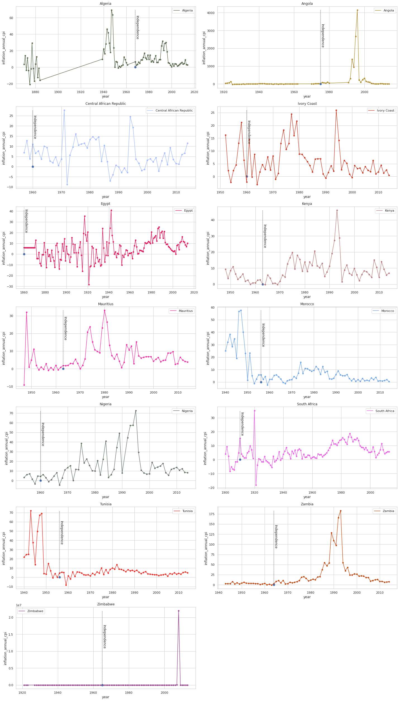
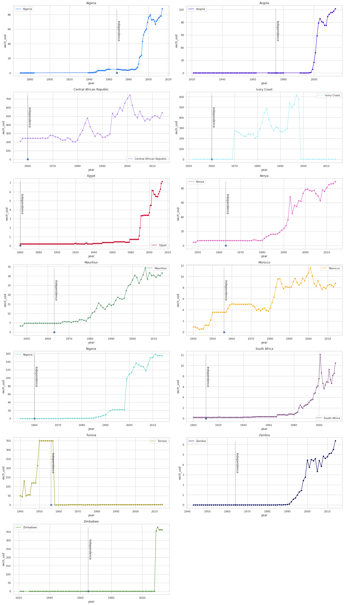
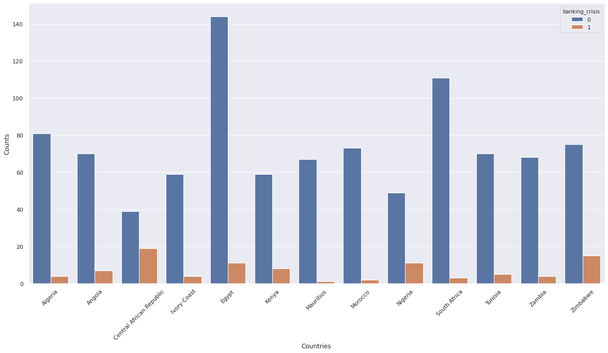

# Economics-In-Africa
An exploratory analysis of economic trends in 13 African countries from 1860 to 2014

## ABOUT THE DATA
The data in this notebook was acquired from a Kaggle dataset (https://www.kaggle.com/chirin/africa-economic-banking-and-systemic-crisis-data?select=african_crises.csv) from Kaggle 
user Chiri (https://www.kaggle.com/chirin).

The dataset is a derivative of Reinhart et. al's Global Financial Stability dataset which can be found online at: https://www.hbs.edu/behavioral-finance-and-financial-stability/data/Pages/global.aspx

It specifically focuses on the Banking, Debt, Financial, Inflation and Systemic Crises that occurred, from 1860 to 2014, in 13 African countries, including: Algeria, Angola, Central African Republic, Ivory Coast, Egypt, Kenya, Mauritius, Morocco, Nigeria, South Africa, Tunisia, Zambia and Zimbabwe.

## METHODOLOGY

This notebook consists of an exploratory data analysis of the variables presented in the dataset. Among some of the variables are the follwoing:

| YEARLY INFLATION RATE   | YEARLY EXCHANGE RATE | SYSTEMIC VS BANKING CRISIS |
| ------------- |:-------------:| -----:|
|         |            |   |

## CONCLUSION AND FUTURE WORK

While banking crisis and systemic crisis are very strongly correlated, no other individual crisis or economic phenomenon such as debt in default can be solely linked to the presence of a systemic crisis. Using a different model, we may be able to determine which factors are more strongly related to systemic crisis.

I will circle back to this kernel at a later date to do some data modeling and predictive analysis.

Thanks for stopping by!
